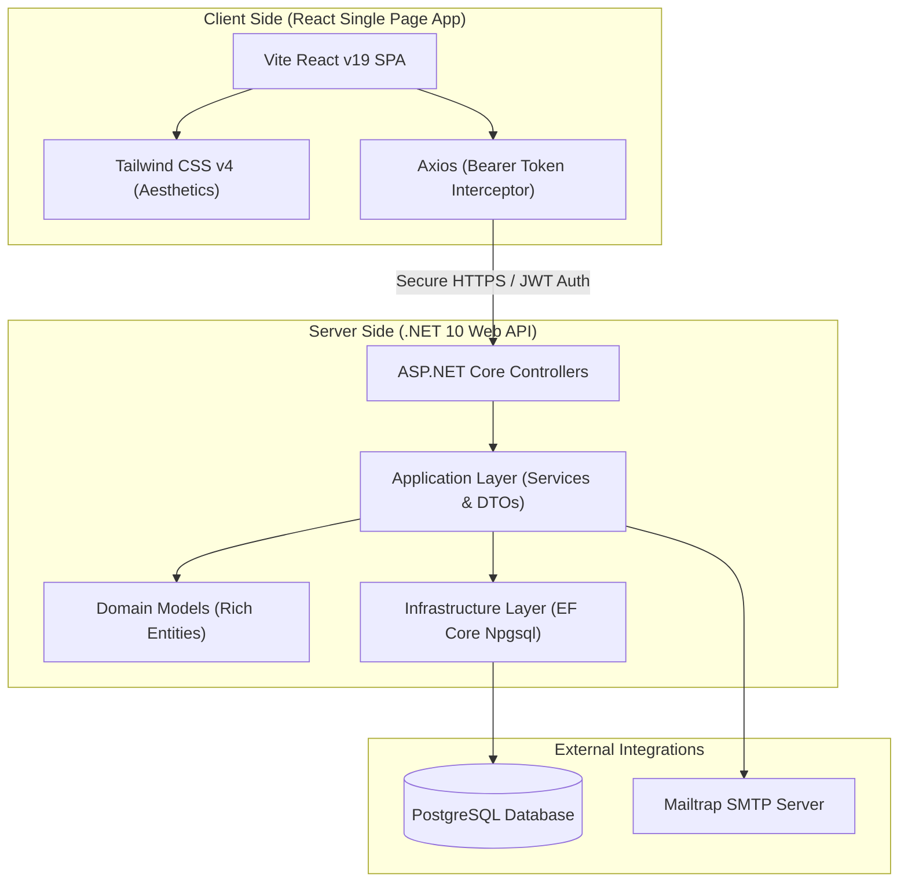

<h1 align="center">🏎️ AutoPart Pro — Enterprise Auto Parts & Service Management System</h1>

<p align="center">
  
  
  
  
  
  
</p>

<p align="center">
  <a href="https://vehicleparts-web.onrender.com" target="_blank">
    
  </a>
</p>

<p align="center">
  <a href="https://vehicleparts-web.onrender.com"><b>🌐 https://vehicleparts-web.onrender.com</b></a>
  &nbsp;|&nbsp;
  <b>Default Login:</b> admin@autopartpro.com &nbsp;/&nbsp; Admin@123
</p>

<p align="center">
  A state-of-the-art Web Application designed to streamline operations for automotive part dealerships, service garages, and customers. Feature-rich dashboards for <b>Administrators</b>, <b>Staff</b>, and <b>Customers</b>.
</p>

---


## 🛠️ System Architecture

The project is built as a highly decoupled Monorepo, facilitating smooth separation of concerns and effortless modern containerized cloud deployments:



---

## ✨ Features Checklist

### 👑 Administrator Features
- [x] **Financial Reports**: Generates automated summaries of sales volume, credit limits, and high-margin transactions.
- [x] **Staff Management**: Fully integrated CRUD system to control staff credentials, active profiles, and roles.
- [x] **Inventory & Part Management**: Add, update, and audit auto-parts with low-stock automatic flagging and alerts.
- [x] **Vendor Management**: Tracks supplier details, contract terms, active listings, and inventory supply status.
- [x] **Purchase Invoices**: Auto-updates inventory/stock counts upon the registration of bulk purchase invoices from vendors.

### 👥 Staff Features
- [x] **Customer Registration**: Collects customer contact information alongside multi-vehicle ownership histories.
- [x] **Sales Invoices**: Dynamic invoice calculations integrated with customer loyalty system rewards.
- [x] **Appointment & Ticket Schedules**: Approves, reschedules, or updates ongoing maintenance, repairs, and service items.
- [x] **Customer History & Auditing**: Unified history views of specific purchases and repair timelines.

### 👤 Customer Self-Service Portal
- [x] **Self-Service Booking**: Creates appointment bookings and submits custom parts procurement requests.
- [x] **Loyalty Point Tracker**: Visualizes points acquired, membership tier details, and dynamically checks discount eligibility.
- [x] **Feedback & Service Reviews**: Direct star ratings and descriptive written logs submitted for rendered garage repairs.
- [x] **Self History**: Instantly review invoices, purchase dates, and past service tickets.

---

## 🚀 Setup & Installation (Local Development)

### Prerequisites
* [.NET 10.0 SDK](https://dotnet.microsoft.com/download/dotnet/10.0) installed.
* [Node.js v18 or later](https://nodejs.org/) installed.
* A local or hosted [PostgreSQL Instance](https://www.postgresql.org/).

### 1. Database Setup
Ensure PostgreSQL is running and create a database named `VehiclePartsDB`. Alternatively, the system will attempt to create this database automatically during the initial build/boot.

### 2. Backend Config & Run
1. Navigate to the backend directory:
   ```bash
   cd Backend
   ```
2. Open `VehicleParts.API/appsettings.json` and adjust the connection string to match your local credentials:
   ```json
   "ConnectionStrings": {
     "defaultConnection": "Host=localhost;Port=5432;Database=VehiclePartsDB;Username=postgres;Password=your_password"
   }
   ```
3. Run migrations and start the server:
   ```bash
   dotnet run --project VehicleParts.API
   ```
4. The server will boot and host the API locally (typically at `http://localhost:5213`).

### 3. Frontend Config & Run
1. Navigate to the frontend directory:
   ```bash
   cd ../Frontend
   ```
2. Install npm dependencies:
   ```bash
   npm install
   ```
3. Boot up the Vite development server:
   ```bash
   npm run dev
   ```
4. Access the web app in your browser at `http://localhost:5173`.

---

## 🙋‍♂️ My Contributions & Project Role

This section outlines the core technical implementations, architecture decisions, and modules that I built during this project:


### 💻 Key Code Implementations
* **Dynamic Monorepo Consolidation**: Refactored the independent repositories into a clean, modern monorepo layout that integrates C# and React into a unified codebase.
* **Production Environment Configurations**: Refactored frontend API calling mechanisms (`src/services/api.js`) to implement production environment variables (`VITE_API_URL`), making the project deployment-ready for cloud hosts like Render.
* **Cloud Containers (Docker)**: Created custom multi-stage Docker builds utilizing highly optimized .NET 10.0 Alpine environments to support serverless deployments.
* **Database Pipeline Automation**: Integrated EF Core migration steps directly into the startup lifecycle, automating cloud database seeding (`DbSeeder.cs`) and structural configurations.

---

## 📄 License
This project is licensed under the MIT License - see the [LICENSE](LICENSE) file for details.
